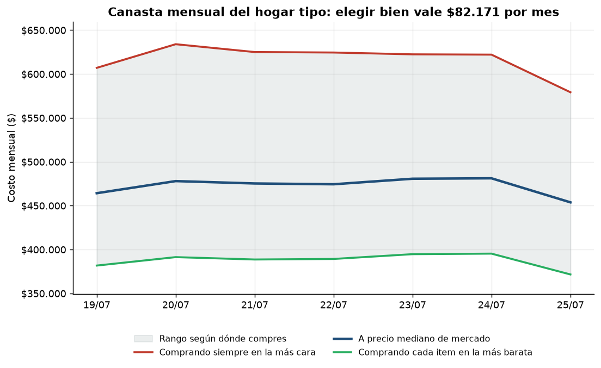
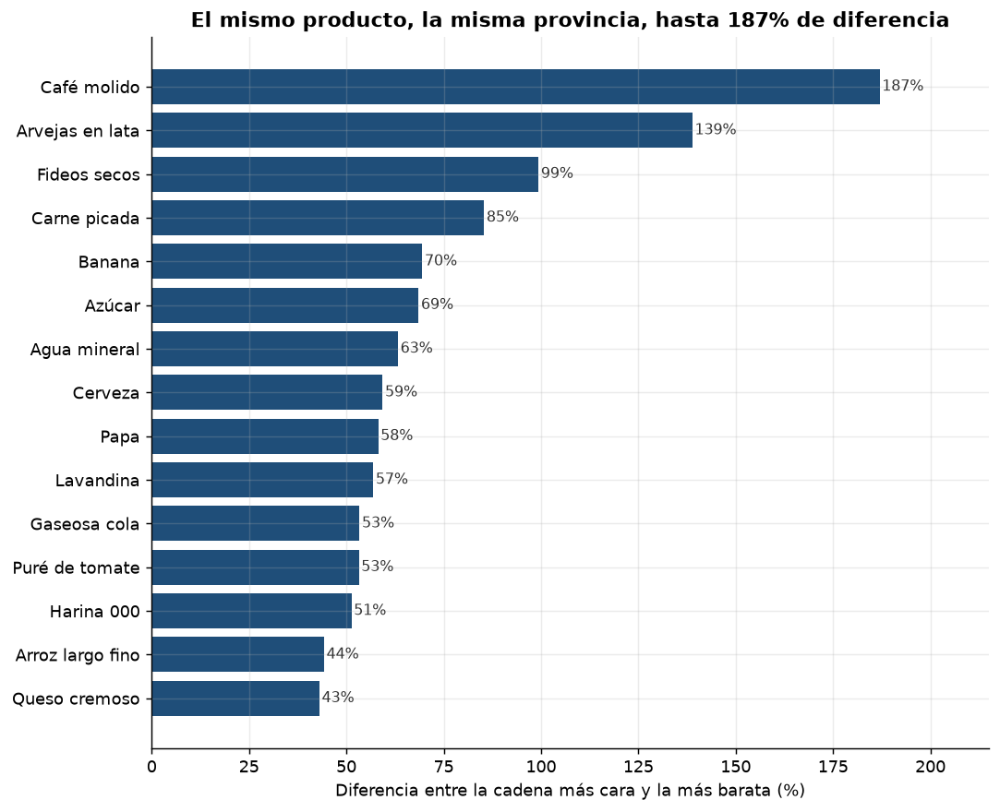
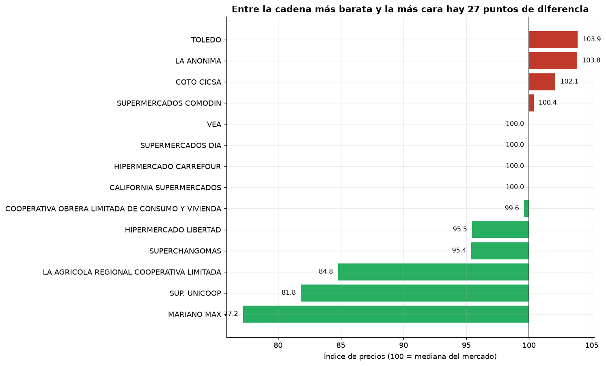

# Radar de Precios Argentina

Pipeline de datos y análisis sobre la base **SEPA** (Sistema Electrónico de Publicidad de Precios Argentinos): los precios que los supermercados le reportan por ley, todos los días, a la Secretaría de Comercio Interior.

> **La pregunta:** ¿cuánto varía el precio del mismo producto según dónde lo compres, y cuánto le cuesta eso por mes a un hogar argentino?

**[→ Ver el dashboard interactivo](https://jgarciarios.github.io/radar-precios-ar/reports/dashboard.html)**

---

## Hallazgos

| | |
|---|---|
| **47,1%** | Diferencia mediana entre la cadena más cara y la más barata, mismo producto, misma provincia, precio por kilo o litro |
| **$82.171** | Lo que gasta de más por mes un hogar de 4 personas comprando en la cadena equivocada — un **18,1%** de la canasta |
| **−2,2%** | Variación de la canasta entre el 19 y el 25 de julio de 2026 |
| **24,4%** | De los productos: las dos fuentes oficiales del tamaño del envase **se contradicen entre sí** |

Escala procesada: **101,6 millones de registros** en 7 días, de 18 cadenas y 3.170 sucursales, sobre ~82.000 productos únicos por día.







---

## Por qué este proyecto

El dato es público, pero está publicado de una forma que lo hace casi inusable:

- Un ZIP diario de ~330 MB, con un ZIP anidado por cadena adentro
- **No hay histórico**: son 7 recursos rotativos nombrados por día de la semana ("Lunes", "Martes") que se sobrescriben cada semana. Solo existe una ventana móvil de 7 días. Lo que no bajaste, se perdió para siempre.
- Delimitadores y encabezados que varían entre archivos
- Un campo llamado `productos_ean` que **no contiene el EAN**
- Unidades de medida escritas como texto libre (`gr`, `GR`, `grs`, `LTS`) mezcladas con códigos del estándar UN/CEFACT (`kgm`, `cmq`, `ea`) en la misma columna, sin nada que las distinga

El trabajo real no es graficar. Es dejarlo consultable y saber cuánto se le puede creer.

## Arquitectura

```
SEPA (7 recursos rotativos)
      │  extract.py     descarga idempotente, descompresión recursiva,
      │                 resolución de la fecha real desde el contenido del ZIP
      ▼
  data/raw/YYYY-MM-DD/<cadena>/{comercio,sucursales,productos}.csv
      │  clean.py       tipos, 5 reglas de calidad con guardrail,
      │                 tamaño del envase y precio por unidad base
      ▼
  data/interim/fecha=YYYY-MM-DD/precios.parquet   (particionado, snappy)
      │  transform.py   DuckDB sobre los parquet, sin cargar nada a RAM
      ▼
  data/processed/*.csv                            (modelo estrella)
      │  figuras.py + dashboard.py
      ▼
  reports/figs/*.png  +  reports/dashboard.html
```

**14,5 millones de filas limpias en 41 segundos** en una MacBook Air. DuckDB consulta los Parquet directamente desde disco: se agregan decenas de millones de filas sin escribir una línea de Spark ni pagar un warehouse.

## Las tres decisiones que sostienen el análisis

### 1. Comparar precio por kilo o litro, nunca precio de envase

Sin normalizar, "la cerveza más barata" es una lata de 269 ml y "la más cara" un barril de 50 litros. El rango de la cerveza pasó de **$648 – $148.997** (precio de envase, sin sentido) a **$2.053 – $3.760 por litro**. Y ahí apareció un hallazgo que el ruido tapaba: la lata de 269 ml cuesta **30% más por litro** que el envase de un litro.

### 2. El tamaño sale de la descripción, no de las columnas de presentación

SEPA tiene campos dedicados al tamaño del envase, pero medidos sobre datos reales no son confiables: el 39% de los envases con peso vienen declarados como "1 unidad", y hay botellas de 900 ml informadas como "1 gr", lo que da precios de $97.000.000 por litro.

La descripción del producto —lo que la cadena le muestra al cliente— sí lo trae: `"FIDEO GUISERO 500 GR"`. El parser (`src/tamano.py`) resuelve coma decimal, pegado sin espacio, multipacks y venta a granel, con 28 casos de prueba.

Cuando ambas fuentes están disponibles, **el pipeline mide cuánto se contradicen** en vez de elegir una en silencio: 24,4%, y estable día a día. Que sea estable importa — no es un archivo roto, es un problema sistemático de carga.

### 3. Filtrar por comparabilidad, y reportarlo aparte de la calidad

Una banana suelta a $799 y un kilo de banana a $7.050 son **dos precios correctos**. Lo que está mal es compararlos. Por eso hay dos filtros distintos y dos reportes distintos:

- **Calidad**: el dato está mal (precio nulo, EAN inválido, duplicado). Descarta 0,05% – 0,10%.
- **Comparabilidad**: el dato está bien pero no es comparable. Deja 83,9% de la canasta.

Mezclarlos sería inflar el porcentaje de "datos sucios" y quedar mejor parado de lo que corresponde.

Para el segundo filtro, la mediana de referencia de cada producto se calcula **solo con las filas de la fuente confiable**, y contra esa referencia se auditan todas las demás. Dejar que la mediana la definan también las filas dudosas es dejar que el ruido decida qué es normal.

## Calidad de datos

Todas las reglas están medidas, no asumidas: `data/interim/_calidad.csv` registra cuánto descartó cada una, cada día.

| Regla | Motivo |
|---|---|
| Precio nulo o EAN vacío | fila inservible |
| Precio fuera de `[1, 5.000.000]` | error de carga |
| EAN de largo inválido | código mal formado |
| Duplicado (comercio, sucursal, EAN) | doble reporte |
| Precio > 10× la mediana de ese EAN ese día | coma decimal mal cargada |

**Guardrail:** si una regla descarta más del 20% de las filas, el pipeline **corta y muestra ejemplos de lo que estaba tirando**. Nació de un bug real: asumí que el campo `productos_ean` contenía el código de barras —en realidad es la *cantidad* de EANs, y vale 1 en casi todas las filas—, descarté el 100% de los datos y el proceso siguió sin quejarse, escribiendo un parquet vacío. Contar cuántas filas se descartan no alcanza; hay que poder ver cuáles.

## Verificación

`tests/test_pipeline.py` recalcula todos los agregados en pandas y los compara contra lo que produjo DuckDB, más siete invariantes de negocio.

```bash
python -m tests.test_pipeline   # 7/7 verificaciones pasan
python -m src.tamano            # 28/28 casos del parser
```

Que un dashboard se vea lindo no significa que el número esté bien.

## Limitaciones

- **SEPA cubre solo grandes superficies.** No incluye almacenes de barrio, ferias ni mayoristas, que es donde compra buena parte del país.
- **Son precios de lista**, sin promociones ni descuentos bancarios, que en Argentina mueven el precio efectivo más que la lista.
- **Los productos se identifican por patrones de texto** sobre la descripción. Un item puede capturar presentaciones distintas del mismo producto.
- **La muestra cambia día a día**: entre el 19 y el 25 de julio el número de cadenas que reportan osciló entre 16 y 18. Una variación entre fechas puede reflejar composición de la muestra y no un cambio real de precios.
- **Las cantidades mensuales del hogar tipo son un supuesto propio**, editable en `src/canasta.py`. No son las del INDEC, y esta canasta no pretende ser un IPC alternativo.
- **Solo 7 días de serie**, porque el portal no conserva histórico. El pipeline está pensado para correr a diario y acumular.

## Cómo correrlo

```bash
git clone <este-repo> && cd radar-precios-ar
python3 -m venv .venv && source .venv/bin/activate
pip install -r requirements.txt
```

**Demo en 30 segundos, sin descargar nada:**

```bash
make demo
```

Genera datos sintéticos que imitan el formato **y la mugre** de SEPA (delimitador `|`, precios `1.234,56`, EANs rotos, duplicados, comas decimales mal cargadas, unidades no estándar), y corre el pipeline entero.

**Con datos reales:**

```bash
python -m src.extract --listar     # ver los 7 días disponibles
python -m src.extract --aux        # metadata oficial + traductor de provincias
python -m src.extract --todos      # descargar los 7 (~2,3 GB)
make todo                          # clean + transform + figuras + dashboard + tests
```

Los datos crudos pesan GB. Para guardarlos fuera del repo:

```bash
export RADAR_DATA_DIR=/ruta/a/tu/disco
```

## Estructura

| | |
|---|---|
| `src/extract.py` | descarga desde CKAN, descompresión recursiva, resolución de fechas |
| `src/clean.py` | reglas de calidad con guardrail, precio por unidad base |
| `src/tamano.py` | parser del tamaño del envase desde la descripción |
| `src/unidades.py` | normalización de unidades a kg / l / unidad |
| `src/canasta.py` | definición de los 29 productos y sus cantidades mensuales |
| `src/transform.py` | agregados analíticos en DuckDB |
| `src/dashboard.py` | genera el HTML interactivo |
| `notebooks/01–03` | exploración, calidad de datos, hallazgos |

## Stack

Python 3.14 · pandas 3 · DuckDB · PyArrow · matplotlib · Chart.js

## Datos

[Precios Claros – Base SEPA](https://datos.produccion.gob.ar/dataset/sepa-precios), Secretaría de Comercio Interior. Licencia de datos abiertos de la Administración Pública Nacional.

## Qué haría con más tiempo

- Orquestar la ingesta diaria (Prefect o Airflow) con alertas cuando una cadena deja de reportar — hoy la ventana de 7 días se pierde si nadie la baja
- Tests de calidad declarativos (Great Expectations) en lugar de reglas hardcodeadas
- Matcheo de productos por embeddings de la descripción, en vez de patrones de texto
- Serie de 12+ meses para contrastar contra el IPC del INDEC con estacionalidad
